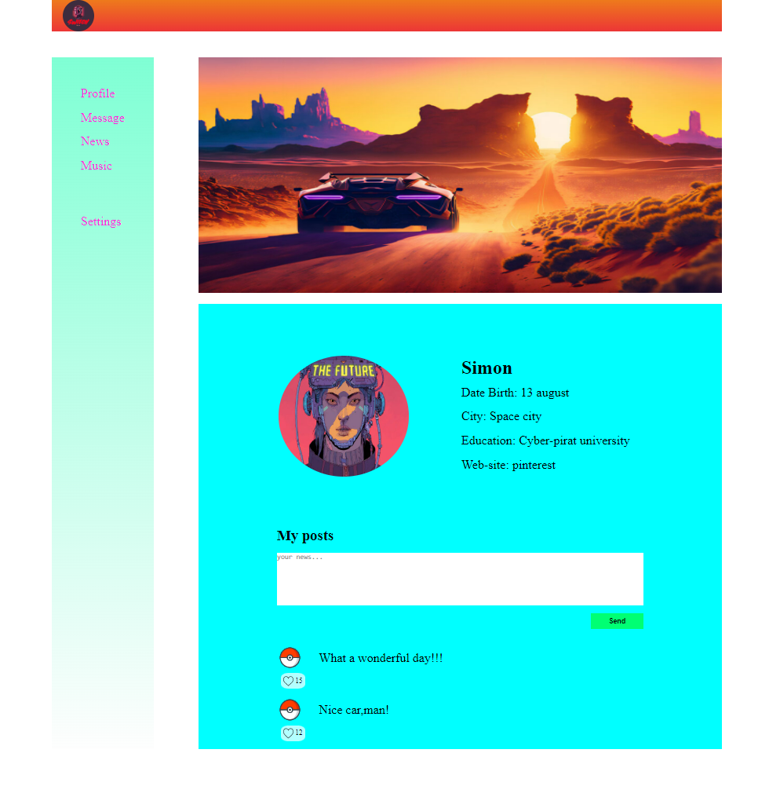

<h1 align="center">Galaxy</h1>

  

---

## Description

The Galaxy is a simplified version of social network.This is a kind of pet app, that help me to understand library React. I've just started my way to front-end developer. I'm studying for just about 2 moths. And It's my first app on React.

## About the project

In this project I'm using [Create React App](https://create-react-app.dev/). So far I'm using components and props.

## Future scope

User's ability to change pages from 'profile' to 'messages' as an for example, post messages on the wall of profile.

Time to time I will change information in this Readme file. All changes of this project will be added here.
